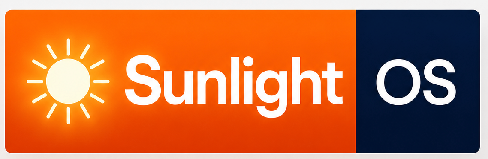
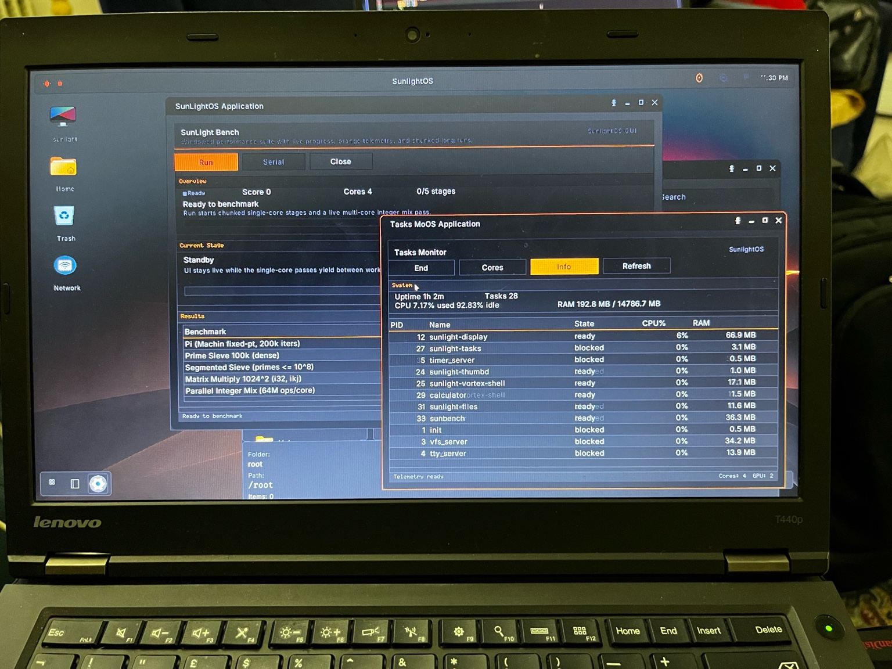
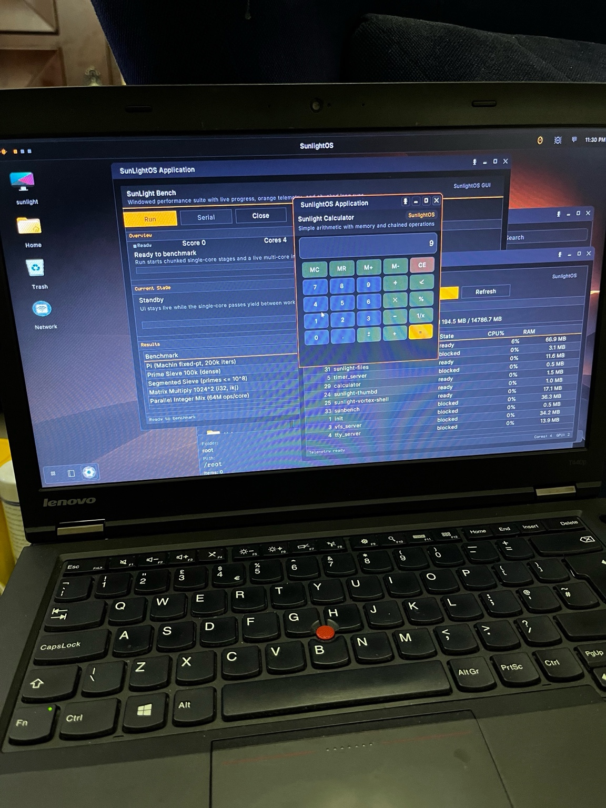
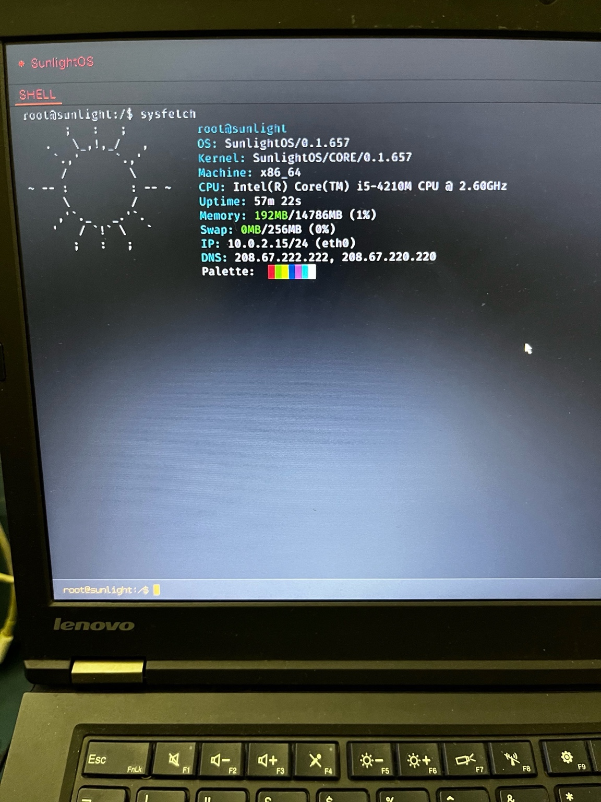
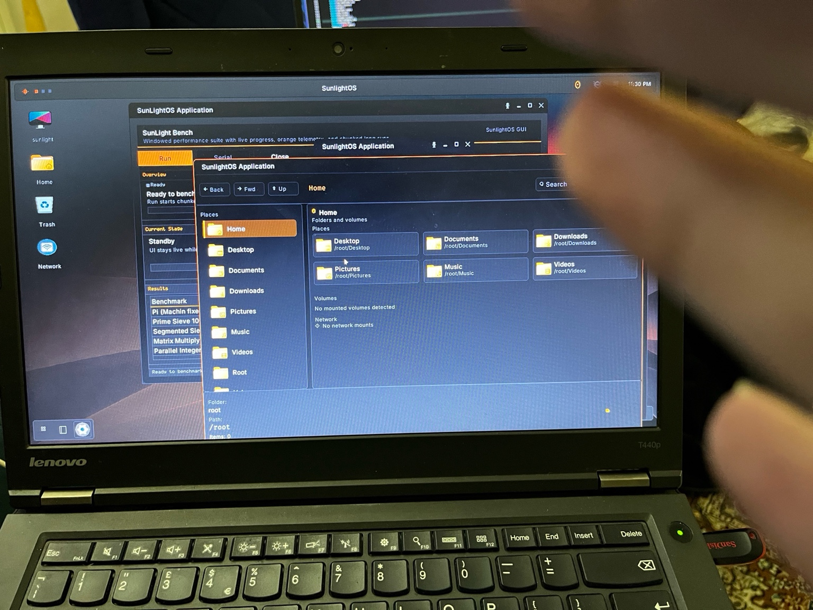

# SunlightOS

**SunlightOS** is an independent operating system written in Rust, featuring a custom capability-based async IPC microkernel with Linux binary compatibility.

**Version:** 0.1.51

<p align="center">
  
</p>

<table>
  <tr>
    <td></td>
    <td></td>
    <td></td>
  </tr>
  <tr>
    <td></td>
    <td></td>
  </tr>
</table>

## Architecture

- **Microkernel (Ring 0):** Scheduler, IPC bus, memory manager, and capability broker.
- **User-space (Ring 3):** Drivers, filesystems, networking, and services.
- **Helios Subsystem:** Linux binary compatibility — translates Linux syscalls to IPC messages.

## Milestone

SunlightOS has reached the point where the kernel core is stable. The remaining work is primarily in Ring 3: drivers, services, userland tools, and polish.

Latest code metrics from Day 25:

- Rust code: 100,362 total lines / 90,640 non-blank
- Documentation: 38,845 total lines / 30,760 non-blank
- All tracked files: 152,228 total lines / 124,879 non-blank
- Rust files: 305
- Cargo manifests: 69
- All tracked files: 529

Microkernel split:

- Kernel Rust: 17,717 lines / 15,954 non-blank
- Non-kernel Rust: 82,645 lines / 74,686 non-blank
- Non-kernel to kernel ratio: 4.66:1 by lines, 4.68:1 by non-blank lines
- Cargo crate ratio: 68 non-kernel manifests to 1 kernel manifest

This is the point where SunlightOS is growing mostly through user-space services, apps, UI, shell, filesystem, networking, and libraries while the kernel stays compact.

## Prerequisites

- **Rust** (nightly toolchain — managed by `rust-toolchain.toml`)
- **QEMU** (`qemu-system-x86_64`)
- **xorriso** (for ISO creation)
- **git**, **make**, **gcc** (for building Limine bootloader)
- **parted**, **dosfstools**, **kpartx** (optional, for `disk.sh`)

Install on Debian/Ubuntu:
```bash
sudo apt-get update
sudo apt-get install -y qemu-system-x86 xorriso git make gcc parted dosfstools
```

## Build Instructions

The first time, the toolchain will be automatically installed by rustup when you run cargo commands.

### Build and run (interactive):
```bash
./tools/build.sh
```
This compiles the kernel, creates a bootable ISO with the Limine bootloader, and launches QEMU with serial output.

### Run automated test:
```bash
./tools/test.sh
```
This builds (if needed), runs QEMU with a timeout, and asserts that the expected boot messages are printed. Exits with code 0 on success, 1 on failure.

### Create test disk image:
```bash
./tools/disk.sh
```
Creates a 64MB FAT32 disk image at `target/sunlightos_disk.img`.

## Workspace Structure

```
sunlightos/
├── kernel/                  # sunlight-kernel — Ring 0 microkernel (no_std)
├── ipc/                     # sunlight-ipc — IPC message types and ABI
├── drivers/                 # sunlight-drivers — user-space driver framework
├── compat-linux/            # sunlight-compat-linux — Helios Linux compatibility
├── sunshell/                # Interactive shell and builtins
├── sunlight-tui/            # Graphical boot splash TUI
├── sunlight-tty/            # TTY client library
├── sunlight-fs/             # RamFS and VFS foundation
├── sunlight-fat/            # FAT32 parser
├── sunlight-virtio/         # Virtio PCI scan and block driver
├── sunlight-block/          # Block device layer
├── sunlight-net/            # TCP/IP stack, DNS resolver
├── sunlight-net-utils/      # ping and network applets
├── sunlight-fetch/          # HTTP download utility
├── sunlight-libc/           # Minimal libc for userland
├── sunlight-elf/            # ELF loader
├── sunlight-utils/          # User/group and system utilities
├── sunlight-tz/             # Timezone database and tzctl
├── sunlight-top/            # Process telemetry TUI
├── services/
│   ├── init/                # PID 1 nameserver bootstrap
│   ├── timer_server/        # Kernel timer IPC service
│   ├── timed/               # Localtime and clock daemon
│   ├── timezone_service/    # Timezone IPC service
│   ├── vfs_server/          # User-space VFS server
│   ├── tty_server/          # TTY multiplexer and login
│   ├── net_server/          # Network stack IPC bridge
│   ├── sunlightd/           # Service supervisor (systemd-like)
│   ├── sunlightctl/         # sunlightd control client
│   ├── sunlight-niced/      # Ring 3 nice daemon + nicectl CLI
│   └── sunlight-gcd/        # Ring 3 garbage collector for tasks/memory
├── docs/                    # Roadmaps, milestone notes, and design notes
└── tools/                   # Build scripts, test harness, disk tools
```

## Current Status

SunlightOS has completed its initial six foundation phases. Work is now organized by
subsystems and milestones rather than numbered phases.

**Foundation status:** Foundation Complete

**Current focus:** Post-Phase Stabilization. The project is shifting toward debugging,
reliability, SMP scheduler stabilization, desktop shell polish, core userland apps,
services, Ring 3 expansion, telemetry, capability/security hardening, and
power-aware scheduling.

## What's Working

### Kernel & Memory
- Physical and virtual memory managers with OOM handling
- Copy-on-write page faults for `fork()`
- `mmap` / `munmap` / `mprotect` syscall family
- **SunBurst scheduler** — adaptive round-robin with burst scoring and nice-aware quantum calculation
- IPC capability broker with shared-memory grants

### Ring 3 Services
- **sunlightd** — service supervisor with unit files, dependency graphs, and restart policy
- **sunlight-niced** — nice-value policy daemon (SunBurst Ring 3 integration); `nicectl` CLI needs polish
- **sunlight-gcd** — garbage collector for orphaned tasks and memory reclamation
- **timed** — localtime, clock, and NTP scaffold
- **timezone_service** — full IANA timezone table with `tzctl`

### Storage & Filesystem
- RamFS initramfs with `/etc/hosts`, `fstab`, and motd
- User-space VFS server with open/read/write/stat
- Virtio-blk driver and FAT32 `/boot` mount
- ELF loader, minimal libc, and exec-from-PATH
- Zram swap with LZ4 compression and reclaim loop

### Terminal & Shell
- Graphical boot TUI (`sunlight-tui`) with ISO 8×16 font
- TTY multiplexer with login screen, tabs, and scrollback
- User/group database, dynamic login prompt, and `passwd`
- **sunshell** — line editing, history, `cd`/`pwd`/`ls`, and builtins
- **sunlight-top** — live process telemetry TUI
- `sysfetch`, `free`, `uname`, and other applets via `/bin`

### Networking
- VirtioNet driver with DHCP and socket IPC
- DNS resolver with `/etc/hosts` lookup and upstream caching
- `ping` by hostname, `net_server` IPC bridge
- **sunlight-fetch** — chunked HTTP downloader integrated into RamFS
- TLS via rustls: working on Linux host builds; kernel integration pending

### Linux Compatibility (Helios)
- `fork`, signals, pipes, and Capsicum FD capabilities
- Helios syscall translation layer (ongoing)
- Block device and VFS syscall wiring

## Documentation

Detailed phase summaries, roadmaps, and design notes live in [`docs/`](docs/README.md).

## License

MIT / Apache-2.0 (to be determined)
