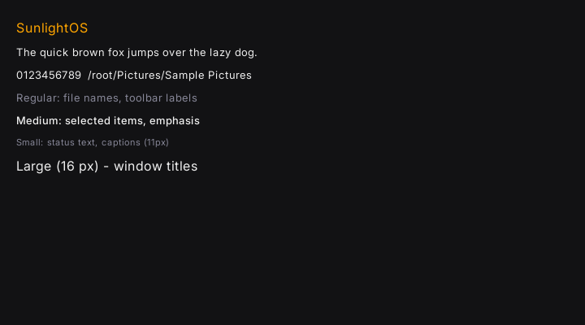

# SunlightOS MiniType Font System

SunlightOS uses a lightweight build-time font pipeline (`sun-font`) to render
antialiased text via pre-rasterised Inter glyphs.  No TTF parser or FreeType
runs at boot — the pixel data is baked into the binary at compile time.

## Why MiniType?

| Choice | Reason |
|--------|--------|
| Build-time rasterisation | Zero startup cost; no heap fragmentation from font loading |
| Inter typeface | Open-source (OFL), designed for screen legibility at small sizes |
| No FreeType/HarfBuzz/Skia | Keeps the userland binary small; SunlightOS has no dynamic linking |
| Custom `.mtf` format | Trivial to parse in `no_std`; 8-byte header + alpha bitmap per glyph |

## Font Roles

| Variant | Source | px | Use |
|---------|--------|----|-----|
| `UiSmall` | Inter Regular | 11 | Status bar, captions, hints |
| `UiRegular` | Inter Regular | 13 | File names, toolbar labels, general UI |
| `UiMedium` | Inter Medium | 13 | Selected items, folder names, emphasis |
| `UiLarge` | Inter Regular | 16 | Window titles, large headings |
| `MonoRegular` | Inter Regular | 13 | Paths, technical metadata (JetBrains Mono drop-in later) |

## Font Asset Paths

**Source TTFs**:
```
docs/fonts/Inter/static/Inter_18pt-Regular.ttf
docs/fonts/Inter/static/Inter_18pt-Medium.ttf
docs/fonts/Inter/static/Inter_18pt-SemiBold.ttf
docs/fonts/FiraCode/ttf/FiraCode-Regular.ttf
docs/fonts/FiraCode/ttf/FiraCode-Medium.ttf
assets/fonts/Material-Icons/MaterialIcons-Regular.ttf   (icon symbols)
```

**Generated MTF files** (baked into the binary at build time, not shipped separately):
```
$OUT_DIR/sunlight_ui_11.mtf
$OUT_DIR/sunlight_ui_13.mtf
$OUT_DIR/sunlight_ui_medium_13.mtf
$OUT_DIR/sunlight_ui_semibold_13.mtf
$OUT_DIR/sunlight_ui_16.mtf
$OUT_DIR/sunlight_ui_title_18.mtf
$OUT_DIR/sunlight_mono_regular_14.mtf
$OUT_DIR/sunlight_mono_medium_14.mtf
$OUT_DIR/material_icons_16.mtf
$OUT_DIR/material_icons_24.mtf
```

Standalone copies are also maintained under:
```
assets/fonts/minitype/*.mtf
```
(Use `assets/fonts/minitype/generate.sh` or `cargo build -p sun-font`.)

For future OS-image installation (dynamic loading path):
```
/usr/share/sunlightos/fonts/minitype/
```
These are seeded into the initramfs (see sunlight-fs/src/ramfs.rs INITRAMFS).

## Material Icons Font

In addition to text fonts, the Material Icons icon font is converted for use as UI symbols (reboot, shutdown, user avatars, etc.).

**Source TTF:**
```
assets/fonts/Material-Icons/MaterialIcons-Regular.ttf
```

**Generated MTF files (ASCII range only, for MTF1 compatibility):**
```
$OUT_DIR/material_icons_16.mtf
$OUT_DIR/material_icons_24.mtf
```

These MTFs (and the full set) are also copied to `assets/fonts/minitype/` and installed into the ramfs at `/usr/share/sunlightos/fonts/minitype/`.

**Actual icon usage in the login screen and TUI (preferred path):**

- `sunlight-tui/build.rs` directly rasterizes specific Private Use Area (PUA) codepoints using `fontdue` at build time.
- It emits 32×32 TGA bitmaps (centered white + alpha) into `OUT_DIR`:
  - `icon_users.tga` (from U+E853 `account_circle`)
  - `icon_reboot.tga` (from U+E053 `restart_alt`)
  - `icon_shutdown.tga` (from U+E8AC `power_settings_new`)
- Drawn with `draw_tga_icon_tinted()` so they inherit the current theme accent / dim colors.
- This replaced the previous checked-in `docs/icons/SunlightOS/actions/32/system-*.tga` files for the login grid (Reboot, Shutdown, Users slots).

**Regenerating / Adding more icons:**

```bash
# Regenerate all .mtf (including material_icons_*)
cargo clean -p sun-font
cargo build -p sun-font

# Or use the helper script (prefers build.rs path; falls back to minitype-cli if present)
./assets/fonts/minitype/generate.sh
```

To use additional Material symbols in the framebuffer TUI (login or elsewhere):

1. Pick the codepoint (use the probe in previous sessions or a font tool).
2. Add a raster + emit call in `sunlight-tui/build.rs` (see `emit_icon_tga`).
3. Add a `const ICON_FOO` include from `OUT_DIR`.
4. Parse with `tga::TgaImage` and draw with `draw_tga_icon` or `draw_tga_icon_tinted`.
5. Rebuild `sunlight-tui` (and dependents like `tty_server`).

Note: The current MTF1 format is limited to 95 ASCII glyphs (0x20–0x7E). Full PUA icon sets are currently handled via direct rasterization in component build scripts or via the standalone minitype-cli path for dynamic loading experiments. Richer multi-range MTF support is planned for the future.

## Regenerating .mtf Files

The `sun-font` build script (`sun-font/build.rs`) regenerates the `.mtf` files
automatically whenever a source TTF changes.  To regenerate manually:

```bash
# Force a clean rebuild of the font bitmaps
cargo clean -p sun-font
cargo build -p sun-font
```

To add **JetBrains Mono** as the proper mono font:
1. Place `JetBrainsMono-Regular.ttf` in `docs/fonts/JetBrainsMono/`
2. Update `sun-font/build.rs` to reference it for `sunlight_mono_13.mtf`
3. Rebuild

## MTF Binary Format

```
[0..4]   magic       : "MTF1"
[4]      line_height : u8   (px, total vertical advance)
[5]      ascent      : u8   (px above baseline)
[6]      glyph_count : u8   (always 95 — ASCII 0x20 ' ' to 0x7E '~')
[7]      reserved    : u8
[8..388] offset_table: 95 × u32 LE  (absolute byte offsets to GlyphHeaders)
[388..]  glyph_data  : variable

GlyphHeader (5 bytes):
  advance : u8
  left    : u8  (reinterpret as i8, left bearing)
  top     : u8  (reinterpret as i8, pixels above baseline to bitmap top)
  width   : u8
  height  : u8

Pixels (width × height bytes):
  Alpha mask, 0 = transparent, 255 = fully opaque
```

## API Quick Reference

```rust
use sun_font::{FontRole, TextStyle, draw_text, measure_text, line_height};

// Draw text — y is the top of the em box
draw_text(&mut canvas, "Hello", x, y, &TextStyle::new(FontRole::UiRegular, color));

// Centred in a rect
draw_text_centered(&mut canvas, rect, "OK", &TextStyle::new(FontRole::UiSmall, color));

// Right-aligned with padding
draw_text_right(&mut canvas, rect, "1.2 MB", &TextStyle::new(FontRole::UiRegular, color), 8);

// Vertically centred in a row of given height
draw_text_vcenter(&mut canvas, "filename.txt", x, row_y, ROW_H,
                  &TextStyle::new(FontRole::UiRegular, theme.text));

// Metrics
let lh: u32 = line_height(FontRole::UiRegular);
let sz: Size = measure_text("path/to/file", FontRole::MonoRegular);
```

## Limitations (v0)

- Latin / printable ASCII only (0x20 – 0x7E).
- Characters outside that range render as `?`.
- No complex text shaping (BiDi, ligatures, kerning pairs).
- No Persian / Arabic / CJK.
- Font data embedded in the binary — not hot-swappable at runtime.

## Future

| Phase | Plan |
|-------|------|
| v0 (now) | MiniType Inter for all UI text |
| v1 | JetBrains Mono for the `MonoRegular` role |
| v2 | Extended Latin (diacritics) via glyph range expansion |
| v3 | Full TTF/OpenType renderer (fontdue or custom) for rich desktop/international text |
| v4 | Per-locale font substitution |

## Sample Rendering


